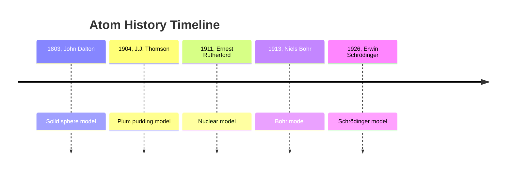

```mermaid
timeline
    title Atom History Timeline
    1803, John Dalton
        : Solid sphere model
    1904, J.J. Thomson
        : Plum pudding model
    1911, Ernest Rutherford
        : Nuclear model
    1913, Niels Bohr
        : Bohr model
    1926, Erwin Schrödinger
        : Schrödinger model
```

