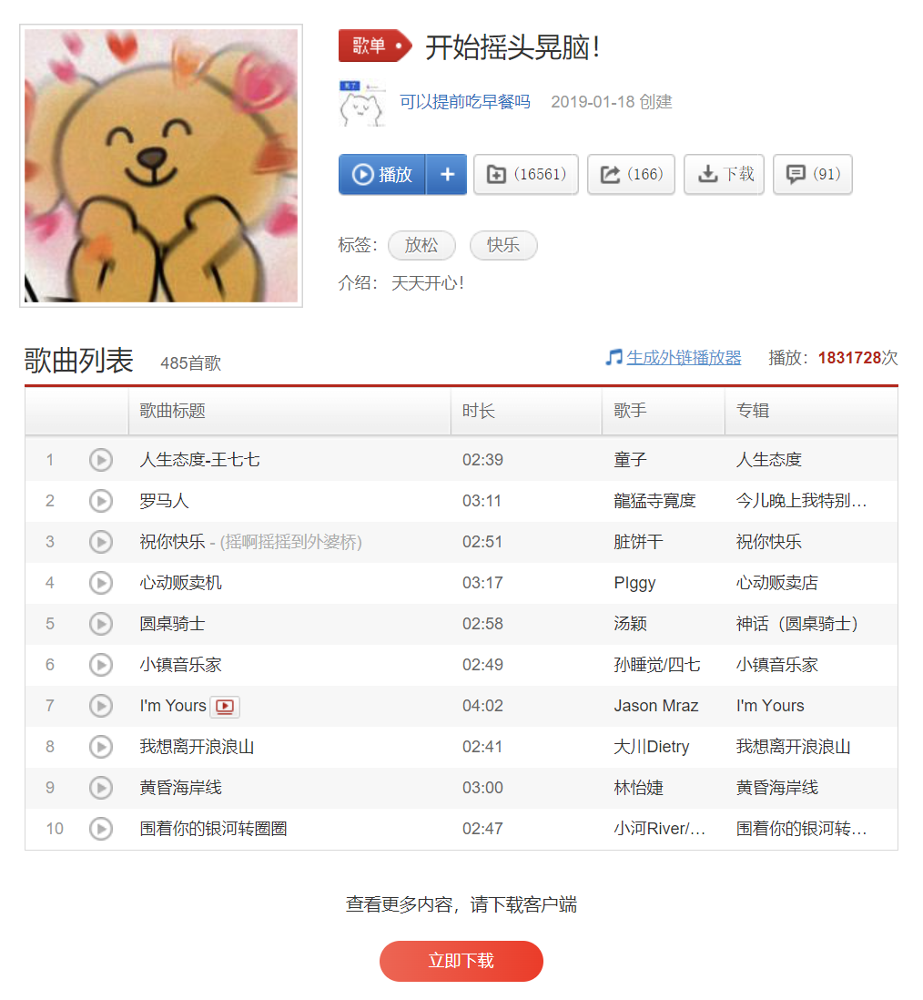
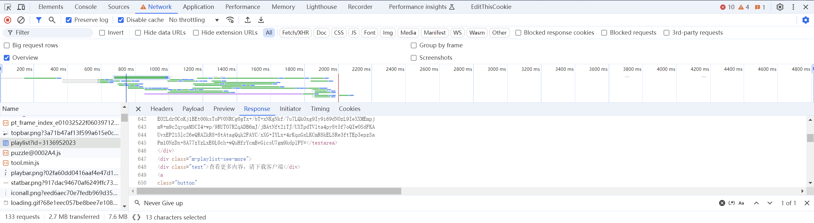
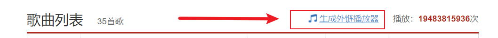
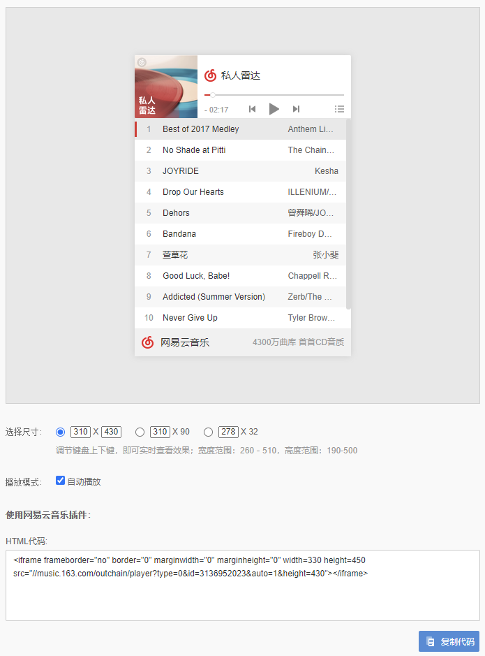
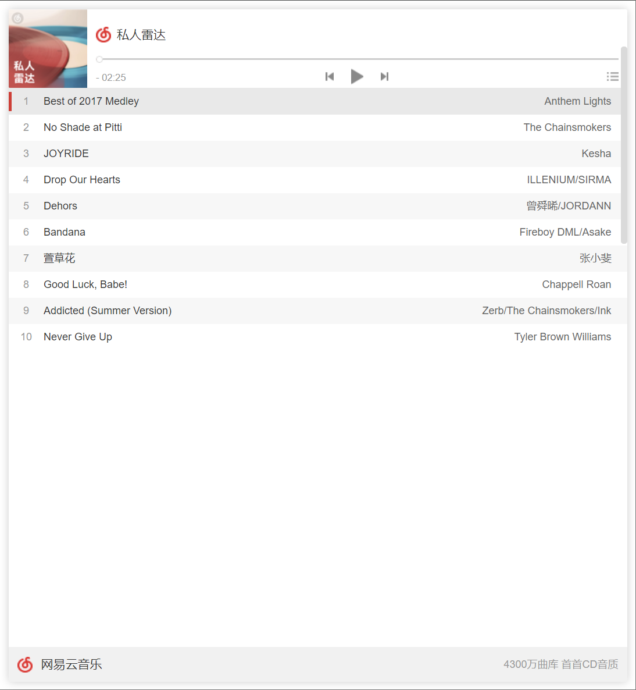
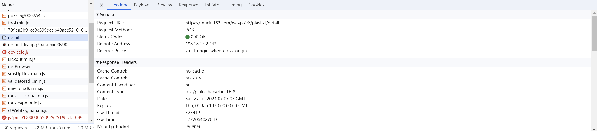
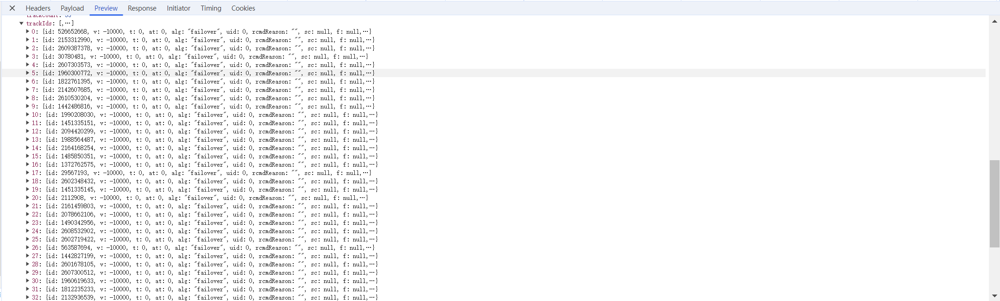
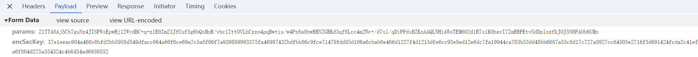
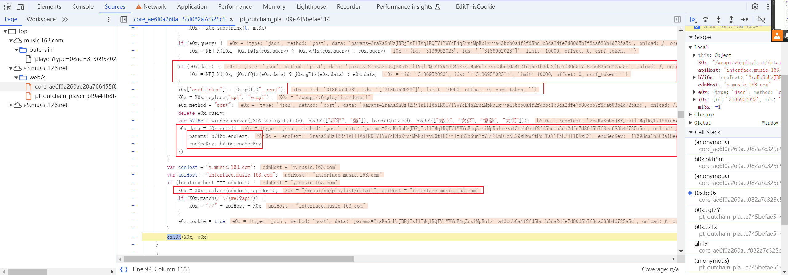
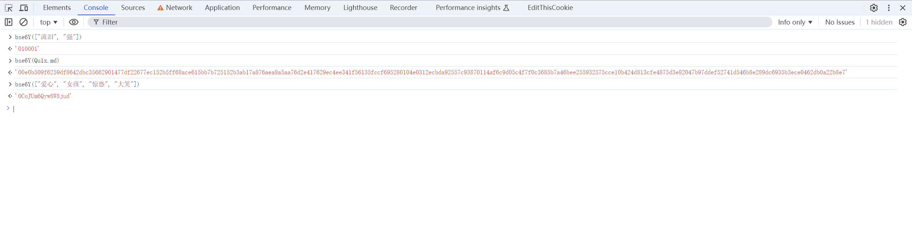

事情的起因，是想给博客的一言做一点小小的改进。准备使用咱喵个人歌单内，随机抽取的歌词作为一言。在获取歌词之前，先要获取歌单内的歌曲列表。然而，网易云的歌单接口并不是那么好获取的。于是，便有了这篇文章。

## 网页版不显示完整歌单



在网页版网易云音乐中，即使是已登录的账号，也无法查看完整的歌单。在前 10 首歌以外的部分，都无法通过这个页面直接查看。

```
https://music.163.com/#/playlist?id=2326800663
```

注意到上面的 URL 中有一个 `#`，这代表以上歌单相关的内容是由 JavaScript 动态渲染的。

如果说在前端中看不见数据，那么能不能通过抓包拿到呢？我们打开 devtools 抓一下数据：

## 抓包数据仍然没有



我们从这个抓包结果中可以看出来，网易云动态加载的并非我们预期中的 JSON，而是一段 HTML 代码。这段 HTML 代码中只有歌单的前 10 首歌曲。因此，这里我们无法通过抓包的方式获取到完整的歌单。

## 外链播放器

这个时候可能我们就会想老老实实去下一个客户端来抓包了，亦或者是直接打退堂鼓。但是，在这个页面上，其实，暗藏了玄机与机遇。



我们注意到有一个叫做「生成外链播放器」的按钮。点击这个按钮后，我们就打开了网易云生成外链播放器的页面。



所谓的外链播放器，实际上是一个 iframe 标签，我们打开看看这个标签内的 URL。



然后，我们抓一下包：



观察到这个 API 地址内有 `/playlist/`，那看来这个 API 就是拿来获取歌单内歌曲的。现在最重要的是确认这个 API 会不会返回完整的歌单内容。



可以看到，这个 API 返回了完整的歌单内容。这就是我们要找的东西。接下来便是逆向这个 API 的请求参数了。

## 逆向 API



首先我们抓一下 `https://music.163.com/weapi/v6/playlist/detail` 的求参数，然后选择 `Initiator`，选择调用栈最顶端开始下断点。

我个人的话，JS 逆向的方式是一层层翻调用栈，然后找到哪一层开始这些加密参数被算出来。在这层下面是未加密的，上面是加密的。或者这层同时存在未加密的和加密的参数。那么这层就是我们要找的加密逻辑了。



可以看到我用红框框出了一些变量的内容，这些数据是 debugger 提取的现在这一刻，这些变量的值。这些值有的是我们抓到的加密参数，有的是我们的歌单 ID，可以推断这部分代码就是，负责加密的逻辑。

更加关键的是，我们看到了一段正在给 `params` 和 `encSecKey` 赋值的代码。这两个参数就是我们要找的加密参数。

```javascript
var bVi6c = window.asrsea(JSON.stringify(i0x), bse6Y(["流泪", "强"]), bse6Y(Qu1x.md), bse6Y(["爱心", "女孩", "惊恐", "大笑"]));
e0x.data = j0x.cr1x({
    params: bVi6c.encText,
    encSecKey: bVi6c.encSecKey
})
```

柿子要挑软的捏，我们先看看 `i0x` 是怎么生成的：

```javascript
var e0x = {
    "type": "json",
    "query": {
        "id": "3136952023",
        "ids": "[\"3136952023\"]",
        "limit": 10000,
        "offset": 0
    }
}; 

var i0x = {};

// i0x = NEJ.X(i0x, j0x.fQ1x(e0x.query) ? j0x.gP1x(e0x.query) : e0x.query)

// NEJ.X 实验一下好像就是把两个对象合并了，playlist 传参只有 query 
// j0x.fQ1x 应该是判断 query 是不是字符串，是的话按照 query 参数的方式解析
// 比如 "id=1&username=abc" 这种叫 query 参数，这里发现 e0x.query 是对象，所以简化一下直接赋值

i0x = e0x.query;

i0x["csrf_token"] = ""; //  这里直接传空字符串就行，下断点抓到的也是空的
```

顺便看一下 `j0x.cr1x` 是什么：

```javascript
>>> j0x.cr1x({
    params: "params",
    encSecKey: "esk"
})

<<< 'params=params&encSecKey=esk'
```

这个函数就是把对象转换成 URL 参数的形式。

然后就是几个硬家伙了，先看 `window.asrsea`，在 f12 的 console 里面发现实际上是 `function d(d, e, f, g)`：
```javascript
// 生成长度为 a 的随机大小写字母数字字符串
function a(a) { // a 是长度
    var b = "abcdefghijklmnopqrstuvwxyzABCDEFGHIJKLMNOPQRSTUVWXYZ0123456789" // 大小写字母和数字
    var c = ""; // 返回的字符串
    var d, e
    for (d = 0; d < a; d += 1) // 循环 a 次
        e = Math.random() * b.length, 
        e = Math.floor(e), 
        c += b.charAt(e); // c 后面拼一个随机选取的字符
    return c
}

// AES 加密，a 是要加密的字符串，b 是密钥，CBC 模式，iv 是 0102030405060708
// 返回加密后的 base64 字符串
function b(a, b) {
    var c = CryptoJS.enc.Utf8.parse(b), 
        d = CryptoJS.enc.Utf8.parse("0102030405060708"), 
        e = CryptoJS.enc.Utf8.parse(a); 
    var f = CryptoJS.AES.encrypt(e, c, {
        iv: d,
        mode: CryptoJS.mode.CBC
    });
    return f.toString()
}

function RSAKeyPair(a, b, c) {
    this.e = biFromHex(a), // RSA e 公钥指数
    this.d = biFromHex(b), // RSA d 私钥指数
    this.m = biFromHex(c), // RSA n 模数
    this.chunkSize = 2 * biHighIndex(this.m),
    this.radix = 16,
    this.barrett = new BarrettMu(this.m)
}

// RSA 加密
function c(a, b, c) {
    var d, e;
    setMaxDigits(131); // 这行好像无所谓？
    d = new RSAKeyPair(b,"",c); // b 是 RSA e，c 是 RSA m
    e = encryptedString(d, a); // RSA 加密 a 使用 d
    return e; 
}


function d(d, e, f, g) {
    var h = {}
    var i = a(16); // 生成长度为 16 的随机字符串
    h.encText = b(d, g) // AES 加密 d 使用密钥 g
    h.encText = b(h.encText, i) // AES 加密上一步的结果使用 i
    h.encSecKey = c(i, e, f) // RSA 加密 i 使用 e 和 f
    return h
}
```

这里的 `d` 函数就是我们要找的加密逻辑了。这个函数接受四个参数，分别是要加密的字符串，RSA 公钥，RSA 模数，AES 密钥。返回一个对象，包含加密后的字符串和密钥。

接下来就是去找这些密钥了，我们先看看 `bse6Y` 是什么：



可以看到 bse6Y 把我们的输入转换成了密钥，我们开始分析这个函数：

```javascript
// 两个下面用到的变量，看起来和表情有关，但是实际上是 mappings，和某个加密参数 mapping 前的状态
Qu1x.emj = {'色': '00e0b', '流感': '509f6', '这边': '259df', '弱': '8642d', '嘴唇': 'bc356', '亲': '62901', '开心': '477df', '呲牙': '22677', '憨笑': 'ec152', '猫': 'b5ff6', '皱眉': '8ace6', '幽灵': '15bb7', '蛋糕': 'b7251', '发怒': '52b3a', '大哭': 'b17a8', '兔子': '76aea', '星星': '8a5aa', '钟情': '76d2e', '牵手': '41762', '公鸡': '9ec4e', '爱意': 'e341f', '禁止': '56135', '狗': 'fccf6', '亲亲': '95280', '叉': '104e0', '礼物': '312ec', '晕': 'bda92', '呆': '557c9', '生病': '38701', '钻石': '14af6', '拜': 'c9d05', '怒': 'c4f7f', '示爱': '0c368', '汗': '5b7a4', '小鸡': '6bee2', '痛苦': '55932', '撇嘴': '575cc', '惶恐': 'e10b4', '口罩': '24d81', '吐舌': '3cfe4', '心碎': '875d3', '生气': 'e8204', '可爱': '7b97d', '鬼脸': 'def52', '跳舞': '741d5', '男孩': '46b8e', '奸笑': '289dc', '猪': '6935b', '圈': '3ece0', '便便': '462db', '外星': '0a22b', '圣诞': '8e7', '流泪': '01000', '强': '1', '爱心': '0CoJU', '女孩': 'm6Qyw', '惊恐': '8W8ju', '大笑': 'd'};
Qu1x.md = ["色", "流感", "这边", "弱", "嘴唇", "亲", "开心", "呲牙", "憨笑", "猫", "皱眉", "幽灵", "蛋糕", "发怒", "大哭", "兔子", "星星", "钟情", "牵手", "公鸡", "爱意", "禁止", "狗", "亲亲", "叉", "礼物", "晕", "呆", "生病", "钻石", "拜", "怒", "示爱", "汗", "小鸡", "痛苦", "撇嘴", "惶恐", "口罩", "吐舌", "心碎", "生气", "可爱", "鬼脸", "跳舞", "男孩", "奸笑", "猪", "圈", "便便", "外星", "圣诞"]; 
```

```javascript
// 基本上就是 k0x.forEach(cH1x) 了
j0x.bh0x = function(k0x, cH1x, O0x) {
    // if (!k0x || !k0x.length || !j0x.gS2x(cH1x))
    //     return this;
    if (!!k0x.forEach) { // 如果 k0x 有 forEach 方法，这里是有的
        k0x.forEach(cH1x, O0x); // O0x 是 this，但是没用到
        return this
    }
    // for (var i = 0, l = k0x.length; i < l; i++)
    //     cH1x.call(O0x, k0x[i], i, k0x);
    // return this
}

var bse6Y = function(cxX9O) {
    var m0x = [];
    j0x.bh0x(cxX9O, function(cxW9N) { // 一手 forEach 把cxX9O 每个元素 ele map 成 Qu1x.emj[ele]
        m0x.push(Qu1x.emj[cxW9N])
    });
    return m0x.join("") // 最后 join 回字符串
};
```

那么我们大概就分析明白这里的参数了。`Qu1x.emj` 是一个映射表，把一些词语映射成一些 16 进制 / 大小写+数字字符串  的内容。`Qu1x.md` 是一个数组，里面是一些词语。`bse6Y` 函数接受一个数组，返回一个字符串，这个字符串是把数组里的每个元素映射成 `Qu1x.emj` 里的内容，然后拼接起来的。

## Python 实现


