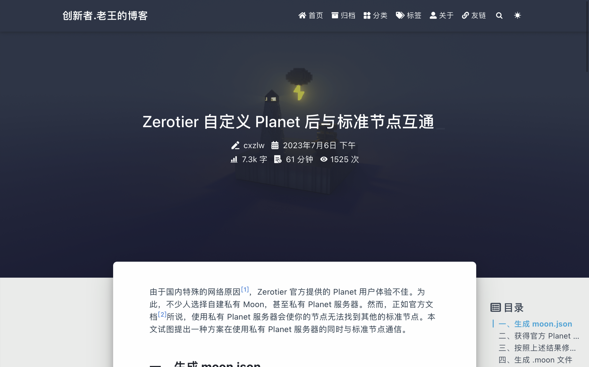
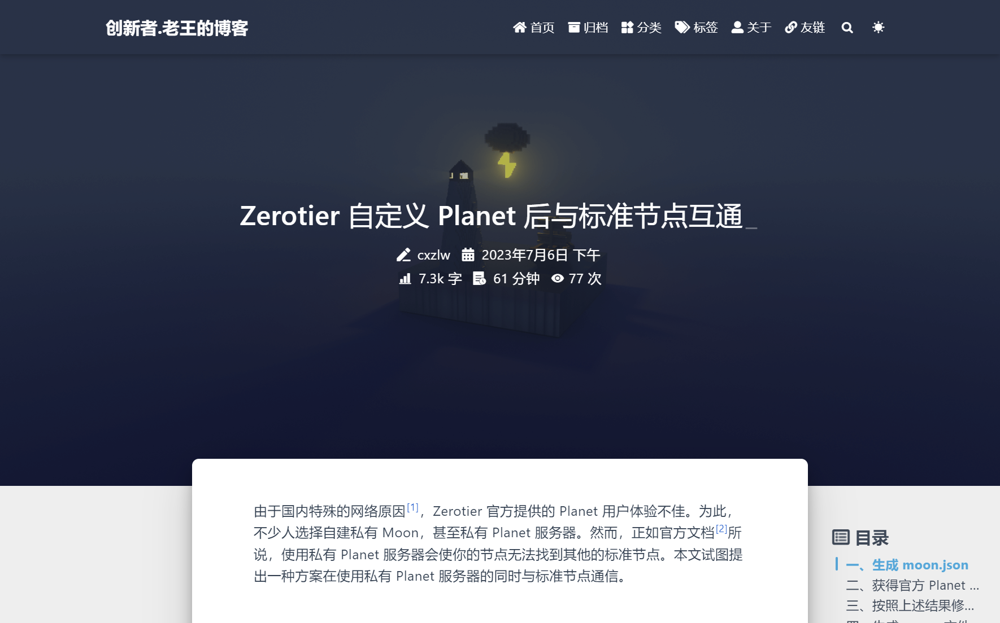
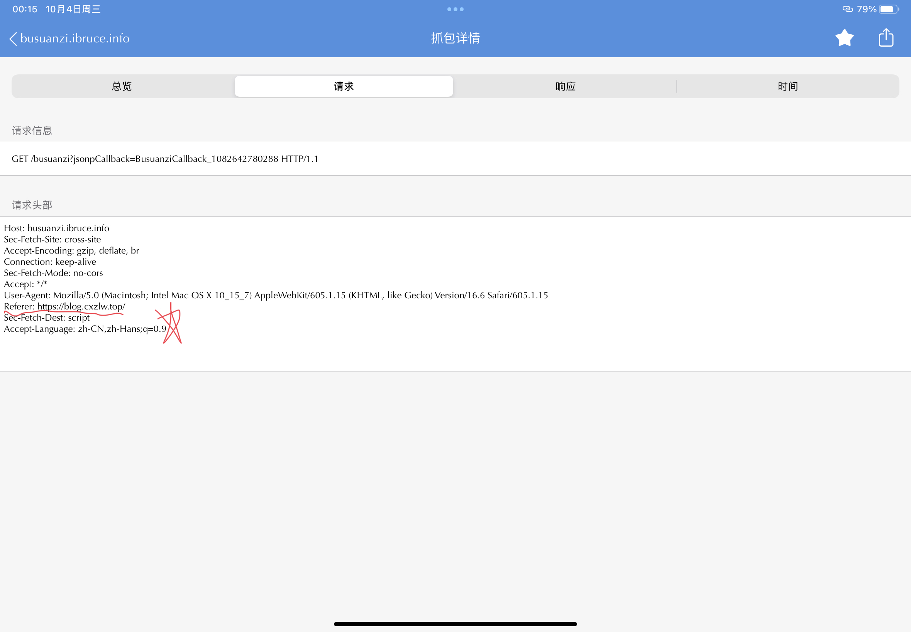
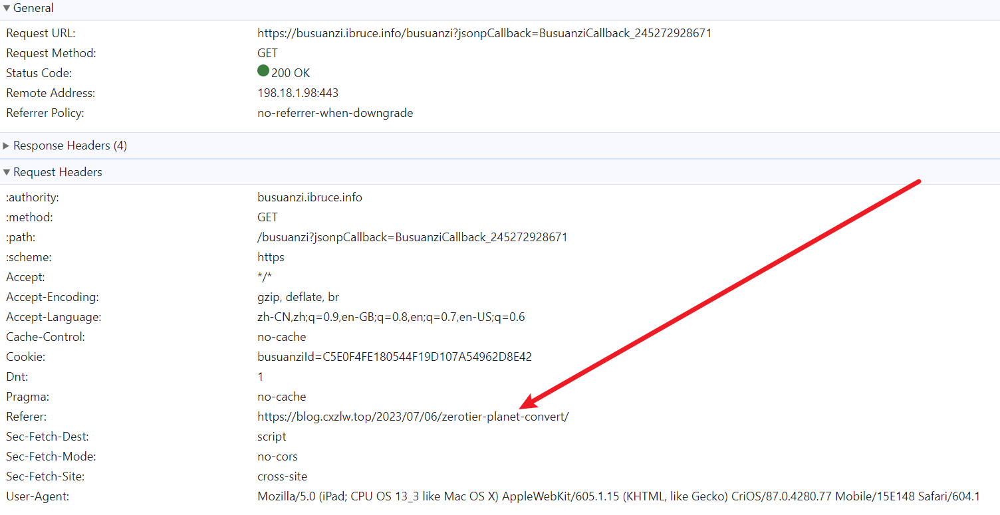
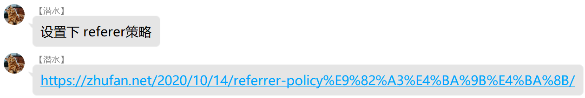

近期，我的博客在 Safari 中，文章访问量异常的大。经过抓包，确认了问题与 Referer 头相关。然而，Referrer-Policy 并没有解决问题。这与其接口设计有关。本文将进行解释，并提出我的解决方案。

## 问题表现






<figcaption aria-hidden="true" class="image-caption">左：Safari 打开效果 右：正常情况打开效果</figcaption>

如图所示，Safari 显示的访问量高达 1k+，比实际访问量高出了 1448 次。这是很奇怪的，引起了我的注意。

## 问题原因

为了找到引起这个问题的原因，我们对上述页面分别向 busuanzi 发的请求都进行抓包。

### Safari



### Chrome



从上面的两个请求，可以看出Safari 向 busuanzi 发送的请求 Referer 头是错误的。这导致 Safari 获得了 `https://blog.cxzlw.top/` 的浏览量信息。这是为什么呢？

## 高人指点

加入 busuanzi QQ 群[^1]后，我在群中询问。并得到了大佬「　」的回复。


图中的链接是：[Referrer Policy那些事 | 煮饭🍚](https://zhufan.net/2020/10/14/referrer-policy%E9%82%A3%E4%BA%9B%E4%BA%8B/)

## Referrer-Policy

发生了什么呢？浏览器开始用 `strict-origin-when-cross-origin` 替换之前的 `no-referrer-when-downgrade` 作为 `Referrer-Policy` 的默认值，而这个新策略破坏了向不蒜子发送的 `Referer` 头。

于是我设置了 `Referrer-Policy`。具体来说，我将下面的代码加入了我的博客：

```html
<meta name="referrer" content="no-referrer-when-downgrade" />
```

还有一些设置 `Referrer-Policy` 的方法：

1. 在 HTTP Header 中添加：`Referrer-Policy: no-referrer-when-downgrade`
2. 在发起请求的 Element 中添加 `referrerpolicy="no-referrer-when-downgrade"` 属性
   例如：`<a href="http://example.com" referrerpolicy="no-referrer-when-downgrade">`

## 穷途末路

事情并没有完，在 Safari 上，我的博客依然无法正常显示浏览量，这又是为什么呢？

在回答这个问题之前，先让我们解决一个前文从未提到的问题「为什么其他浏览器能正常显示？」。

### 为什么其他浏览器能正常显示？

前文 [Referrer Policy那些事 | 煮饭🍚](https://zhufan.net/2020/10/14/referrer-policy%E9%82%A3%E4%BA%9B%E4%BA%8B/) 中提到：

> 之前的默认值是 no-referrer-when-downgrade，而现在变成了 strict-origin-when-cross-origin。经过查找，原来是chrome85以上做出了默认规则的改变。 [A new default Referrer-Policy for Chrome - strict-origin-when-cross-origin - Chrome for Developers](https://developers.google.com/web/updates/2020/07/referrer-policy-new-chrome-default)

既然 Chrome 也作出了上述改变，为什么我的博客在 Chrome 中能正常显示呢？

要回答这个问题，让我们看看 busuanzi 的源码：

```javascript
var bszCaller, bszTag;
!(function () {
    var c,
        d,
        e,
        a = !1,
        b = [];
    (ready = function (c) {
        return (
            a ||
            "interactive" === document.readyState ||
            "complete" === document.readyState
                ? c.call(document)
                : b.push(function () {
                      return c.call(this);
                  }),
            this
        );
    }),
        (d = function () {
            for (var a = 0, c = b.length; c > a; a++) b[a].apply(document);
            b = [];
        }),
        (e = function () {
            a ||
                ((a = !0),
                d.call(window),
                document.removeEventListener
                    ? document.removeEventListener("DOMContentLoaded", e, !1)
                    : document.attachEvent &&
                      (document.detachEvent("onreadystatechange", e),
                      window == window.top && (clearInterval(c), (c = null))));
        }),
        document.addEventListener
            ? document.addEventListener("DOMContentLoaded", e, !1)
            : document.attachEvent &&
              (document.attachEvent("onreadystatechange", function () {
                  /loaded|complete/.test(document.readyState) && e();
              }),
              window == window.top &&
                  (c = setInterval(function () {
                      try {
                          a || document.documentElement.doScroll("left");
                      } catch (b) {
                          return;
                      }
                      e();
                  }, 5)));
})(),
    (bszCaller = {
        fetch: function (a, b) {
            var c =
                "BusuanziCallback_" + Math.floor(1099511627776 * Math.random());
            (window[c] = this.evalCall(b)),
                (a = a.replace("=BusuanziCallback", "=" + c)),
                (scriptTag = document.createElement("SCRIPT")),
                (scriptTag.type = "text/javascript"),
                (scriptTag.defer = !0),
                (scriptTag.src = a),
                (scriptTag.referrerPolicy = "no-referrer-when-downgrade"),
                document.getElementsByTagName("HEAD")[0].appendChild(scriptTag);
        },
        evalCall: function (a) {
            return function (b) {
                ready(function () {
                    try {
                        a(b), scriptTag.parentElement.removeChild(scriptTag);
                    } catch (c) {
                        bszTag.hides();
                    }
                });
            };
        },
    }),
    bszCaller.fetch(
        "//busuanzi.ibruce.info/busuanzi?jsonpCallback=BusuanziCallback",
        function (a) {
            bszTag.texts(a), bszTag.shows();
        },
    ),
    (bszTag = {
        bszs: ["site_pv", "page_pv", "site_uv"],
        texts: function (a) {
            this.bszs.map(function (b) {
                var c = document.getElementById("busuanzi_value_" + b);
                c && (c.innerHTML = a[b]);
            });
        },
        hides: function () {
            this.bszs.map(function (a) {
                var b = document.getElementById("busuanzi_container_" + a);
                b && (b.style.display = "none");
            });
        },
        shows: function () {
            this.bszs.map(function (a) {
                var b = document.getElementById("busuanzi_container_" + a);
                b && (b.style.display = "inline");
            });
        },
    });
```

其中，我们重点关注这段代码：

```javascript
fetch: function(a, b) {
    var c = "BusuanziCallback_" + Math.floor(1099511627776 * Math.random());
    window[c] = this.evalCall(b),
    a = a.replace("=BusuanziCallback", "=" + c),
    scriptTag = document.createElement("SCRIPT"),
    scriptTag.type = "text/javascript",
    scriptTag.defer = !0,
    scriptTag.src = a,
    scriptTag.referrerPolicy = "no-referrer-when-downgrade",
    document.getElementsByTagName("HEAD")[0].appendChild(scriptTag)
},
```

回顾 [Referrer-Policy](#Referrer-Policy) 部分，我们也可以通过在 Element 中添加 `referrerpolicy="no-referrer-when-downgrade"` 属性来设置 `Referrer-Policy`。

这段代码在使用 JSONP 解决跨域的问题时，创建了一个带有 `referrerpolicy` 属性的 Script Tag，以此解决了 Chrome 等浏览器上出现的问题。

### 为什么 Safari 不能？

上面我们解释了为什么 Chrome 等浏览器能正常显示我的博客的浏览量，接下来我们将解释为什么 Safari 中仍然出现这种问题。

[Preventing Tracking Prevention Tracking | WebKit](https://webkit.org/blog/9661/preventing-tracking-prevention-tracking/#:~:text=Origin%2DOnly%20Referrer%20For%20All%20Third%2DParty%20Requests)

> **Origin-Only Referrer For All Third-Party Requests**
> ITP now downgrades all cross-site request referrer headers to just the page’s origin. Previously, this was only done for cross-site requests to classified domains.
>
> As an example, a request to https://images.example that would previously contain the referrer header “https://store.example/baby/strollers/deluxe-stroller-navy-blue.html” will now be reduced to just “https://store.example/”.

原来，Safari 的 **阻止跨站跟踪** 功能会将跨站请求中的 `Referer` 头全部降级为页面的根路径。效果就像 `strict-origin-when-cross-origin`。这无疑对 busuanzi 的请求生效，因此开启了 **阻止跨站跟踪** 的 Safari 便会遇到这个问题。

显然要求每个用户关闭 **阻止跨站跟踪** 是奇怪的，在 busuanzi 作者主动修改 API 不再依赖 `Referer` 头前，似乎这成了一个无解的问题。

## 我的解决方案

我的解决方案是重构我的博客的访问量系统。自己写一个不依赖 `Referer` 头的 API，并将前端与访问量相关的代码重构。

我将会写一篇新的文章介绍这个 API，各位也可以直接抓包分析我的博客。这个 API 欢迎各位使用。但与 [不如](https://ibruce.info/) 不同的是，我无法提供任何可用性保证。

## 参考资料

1. [不蒜子 | 不如](https://ibruce.info/2015/04/04/busuanzi/)
2. [Referrer Policy那些事 | 煮饭🍚](https://zhufan.net/2020/10/14/referrer-policy%E9%82%A3%E4%BA%9B%E4%BA%8B/)
3. [Referrer-Policy - HTTP | MDNMDN Web DocsMDN logoMozilla logo](https://developer.mozilla.org/zh-CN/docs/Web/HTTP/Headers/Referrer-Policy)
4. [不蒜子在 Chrome 85 版本后所有页面统计是同一个数据 · Issue #376 · fluid-dev/hexo-theme-fluid · GitHub](https://github.com/fluid-dev/hexo-theme-fluid/issues/376)
5. [Referrer Policy | Can I use... Support tables for HTML5, CSS3, etc](https://caniuse.com/referrer-policy)
6. [Preventing Tracking Prevention Tracking | WebKit](https://webkit.org/blog/9661/preventing-tracking-prevention-tracking/)

## 注

[^1]: 419260983，来自 busunazi 官网 [不蒜子 | 不如](https://ibruce.info/2015/04/04/busuanzi/#more:~:text=%E5%A3%B0%E6%98%8E%EF%BC%9A%E7%BB%8F%E7%94%A8%E6%88%B7%E5%BB%BA%E8%AE%AE%EF%BC%8C%E6%96%B0%E5%A2%9E%E4%B8%8D%E8%92%9C%E5%AD%90%E4%BA%A4%E6%B5%81QQ%E7%BE%A4%EF%BC%9A419260983%EF%BC%8C%E6%AC%A2%E8%BF%8E%E5%A4%A7%E5%AE%B6%E5%8A%A0%E5%85%A5%E3%80%82%E2%80%94%E2%80%94%20%E4%B8%8D%E5%A6%82%EF%BC%8C2017.02)
