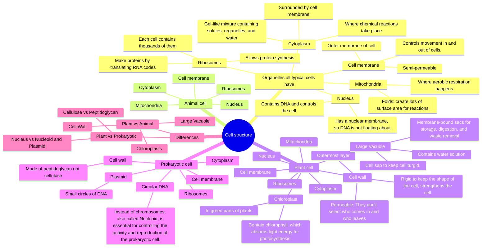
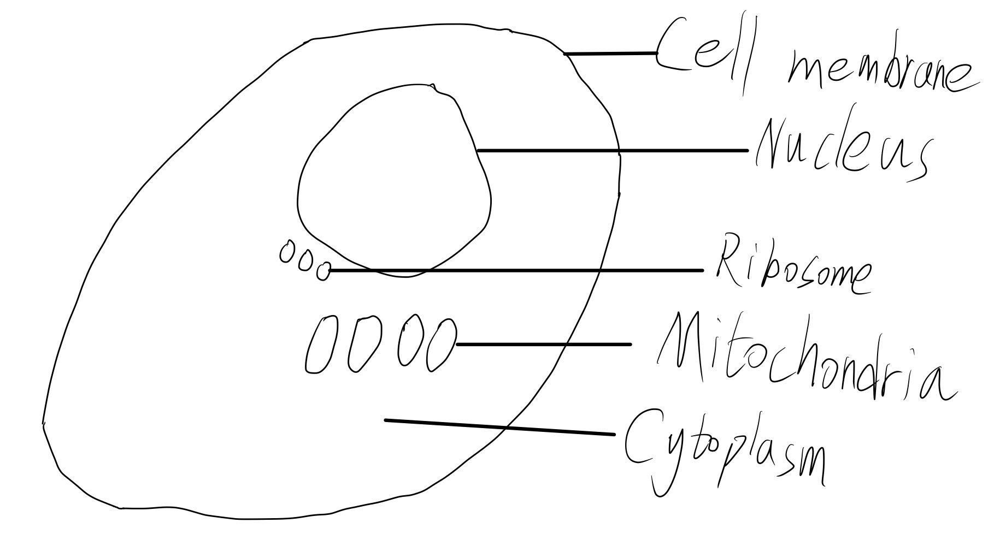
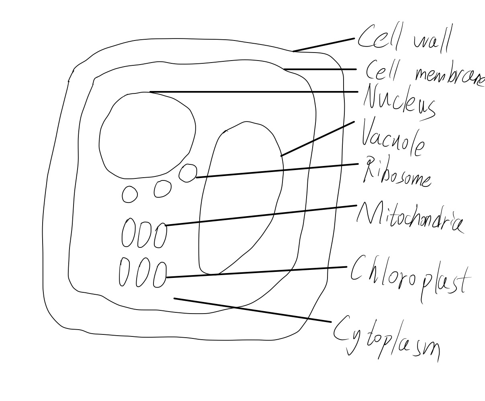
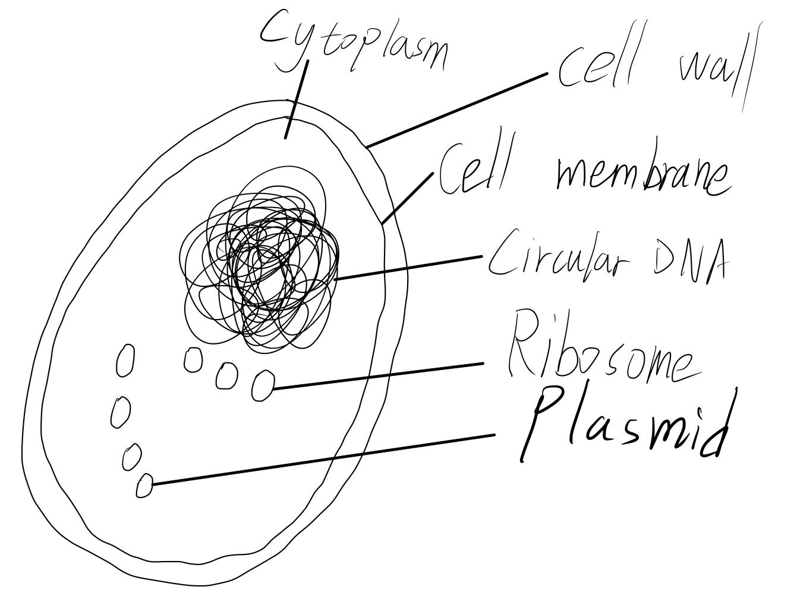

# Cell structure

## Mind map

## Organelles all typical cells have

### Cell membrane

Controls movement in and out of cells.

- Outer membrane of cell
- Semi-permeable

### Cytoplasm

Where chemical reactions take place.

- Surrounded by cell membrane
- Gel-like mixture containing solutes, orangelles, and water

### Nucleus

Contains DNA and controls the cell.

- Has a nuclear membrane, so DNA is not floating about

### Mitochondria

Where aerobic respiration happens.

- Folds: create lots of surface area for reactions

### Ribosomes

Allows protein synthesis

- Each cell contains thousands of them
- Make proteins by translating RNA codes

## Animal cell

Animal cell has all above.

### Diagram

## Plant cell

Plant cell especially also have:

### Cell wall

Rigid to keep the shape of the cell, strengthens the cell.

- Outermost layer
- Permeable: They don't select who comes in and who leaves

### Large Vacuole

Cell sap to keep cell turgid.

- Membrane-bound sacs for storage, digestion, and waste removal
- Contains water solution

### Chloroplast

Contain chlorophyll, which absorbs light energy for photosynthesis.

- In green parts of plants

### Diagram

## Prokaryotic cell

Prokaryotic cell **do not** have Mitochondria and Nucleus but organelles below.

### Cell wall

Rigid to keep the shape of the cell, strengthens the cell.

- Made of __peptidoglycan__ not cellulose

### Circular DNA

Instead of chromosomes, also called _Nucleoid_, is essential for controlling the acticity and reproduction of the
prokaryotic cell.

### Plasmid

Small circles of DNA.

### Diagram

## Differences

### Organelles in cells

| Organelles \ Cells | Plant Cell | Animal Cell | Prokaryotic Cell |
|--------------------|------------|-------------|------------------|
| Cell Wall          | Yes        |             |                  |
| Cell Membrane      | Yes        | Yes         | Yes              |
| Chloroplasts       | Yes        |             |                  |
| Cytoplasm          | Yes        | Yes         | Yes              |
| Mitochondria       | Yes        | Yes         |                  |
| Nucleus            | Yes        | Yes         |                  |
| Ribosome           | Yes        | Yes         | Yes              |
| Large Vacuole      | Yes        |             |                  |
| Circular DNA       |            |             | Yes              |
| Plasmid            |            |             | Yes              |

### Some differences between a plant cell and an animal cell

1. A plant cell has cell wall, while an animal cell hasn't.
2. A plant cell has large vacuole, while an animal cell hasn't.
3. No animal cell has chloroplasts, but some plant cell do.

### Some differences between a plant cell and a prokaryotic cell.

1. A plant cell has nucleus, and a prokaryotic cell has nucleoid and plasmid instead.
2. Cell wall in a plant cell is made of cellulose but peptidoglycan in a prokaryotic cell.


This page was rendered by my blog locally, for a beautiful and well-layouted result, so there are things related to my
blog. These things don't mean it was downloaded from someone's blog. Of course, this page won't be avaliable to the
public before the assessment is no longer accepting submissions.

