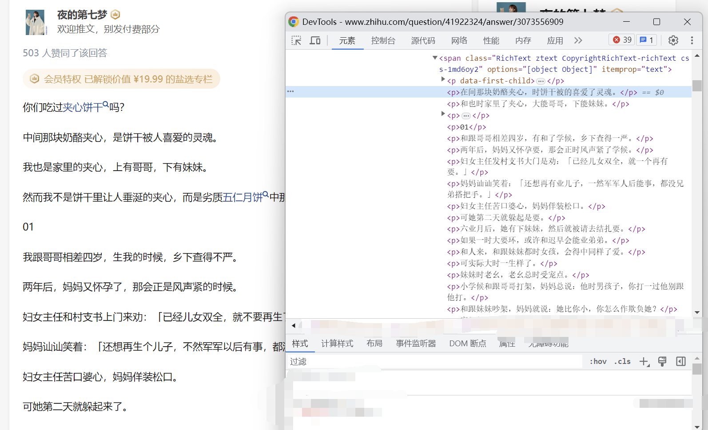
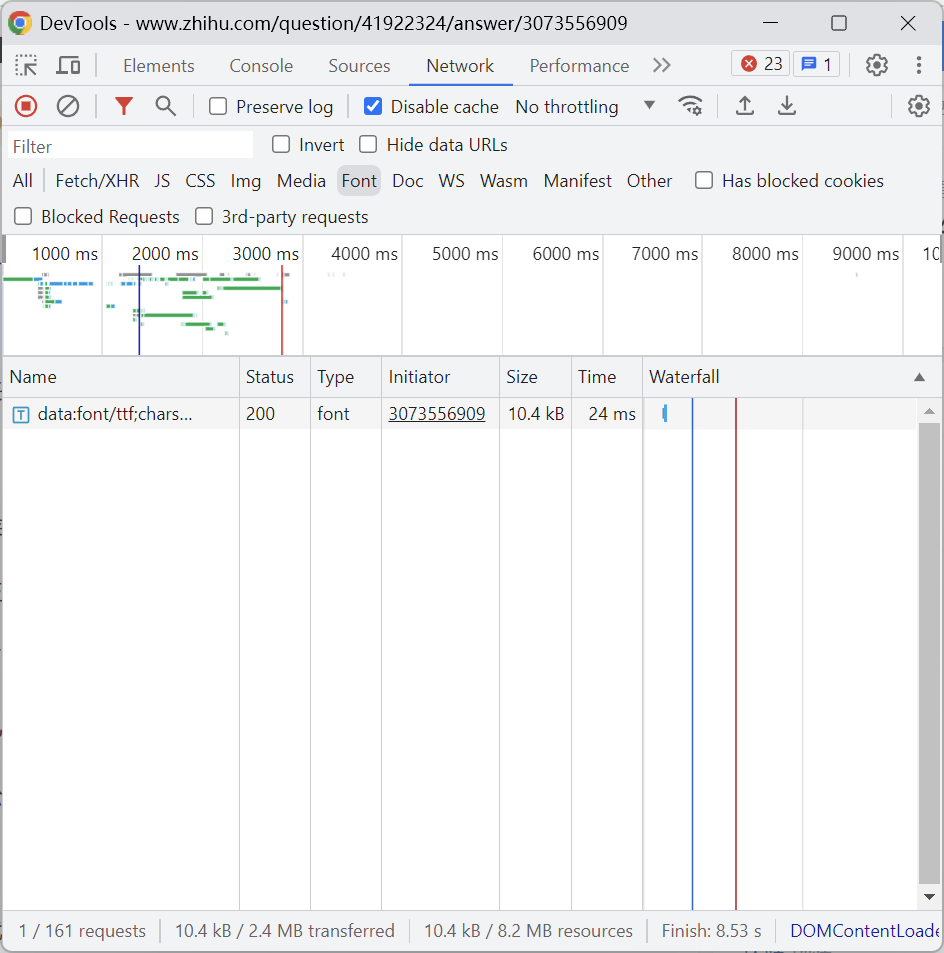
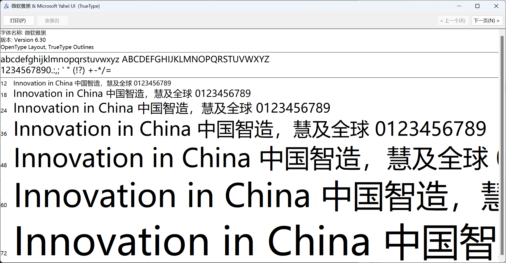
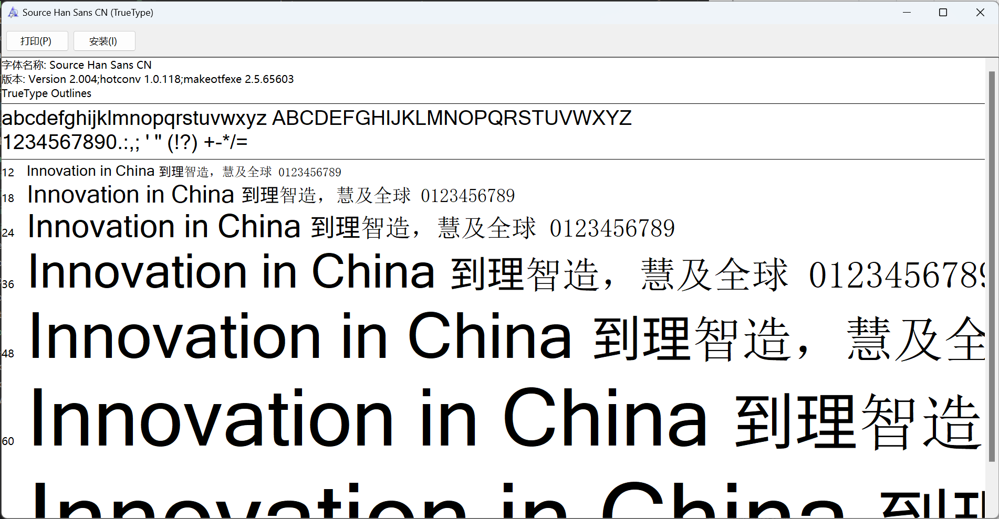
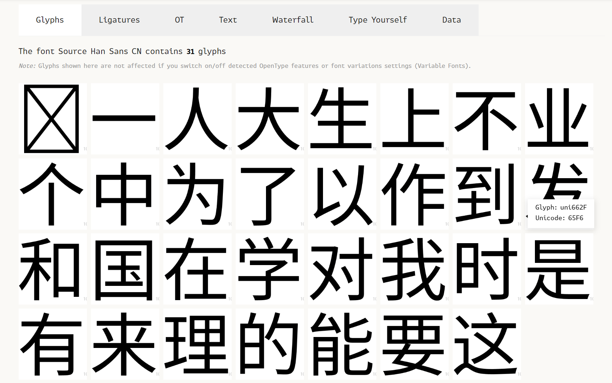

近些阵子知乎上线了针对专栏[^1]中盐选文章的反爬系统，随后该系统也被运用在知乎回答页面中的盐选文章上，具体表现为爬取的文章内容中出现大量的错乱词汇。而在本篇文章中我们将一步步带领各位解开这些乱码，在这个过程中我们将对字体反爬有更深入的认识，并学到运用字体反爬时需要注意的问题。


## 一、知乎反爬效果

来自知乎回答[不被爱是一种什么样的感受？ - 知乎](https://www.zhihu.com/question/41922324/answer/3073556909)

 

如图所示，在页面源码中出现了大量乱码，例如（原字，错字）：[^2]

- 中 -> 在
- 是 -> 时
- 上 -> 大

这些乱码使得文章可读性大大下降，那么乱码是怎么产生的？又如何解决这个问题呢？

## 二、找寻乱码真凶

观察上述现象，页面源码中的字，在被显示到页面后，居然变成了正确的字。因此我们初步推断知乎在该页面运用了字体反爬。

接下来我们打开 F12 -> Network 页面，选择 Font，观察知乎加载的字体。



右键选择 Open in new tab 将字体保存下来。


将字体后缀名改为 .ttf [^3] 并打开。






<figcaption aria-hidden="true" class="image-caption">左：正常字体 右：反爬字体</figcaption>

与正常字体对比，我们下载的字体明显替换了部分字体，这便是知乎用于反爬的字体了。接下来我们将分析这个字体并给出应对方案。

## 三、致命缺陷

字体反爬的根本原理是替换原本的字为一个新字，再用字体将新字渲染为原字，这样对程序而言就只见到新字而不是旧字了，而用户看到的还是原本的内容。因此只要找到新字与原字间的对应关系便可解决该反爬。而要找到这个对应关系，抓住字体中各个字形的特征是必不可少的一环。

我们打开 [FontDrop!](https://fontdrop.info/) 加载字体，向下翻，观察字形的特征。



我们发现字形的 Glyph 为 uni662F  而 Unicode 为65F6，接下来我们试着查询这两个十六进制数对应的字：

```python
glyph = "\u662F"
unicode = "\u65F6"
print(glyph, unicode)
# output: 是 时
```

正好，上文提到，「是」在源码中被替换为了「时」。知乎在反爬字体中保留了原字与新字的对应关系，为我们提供了一个极为便捷的捷径，避免了对字形笔画的具体分析，这也是其字体反爬系统的致命缺陷。

至此，字形的特征与对应关系都被我们分析出了，接下来我们将编写程序从字体中提取对应关系。

## 四、提取对应关系

要提取各个字间的对应关系，首先我们需要安装 fontTools [^4]。

```bash
pip install fonttools
```

用 `ttLib.TTFont(filename)` 打开字体：

```python
from fontTools import ttLib

font = ttLib.TTFont(input("Input font filename: "))
```

初始化一个存储对应关系的字典：

```python
zhihu_dict = {}
```

遍历字形，获得其 Glyph 与 Unicode，并写入字典（注意这里的Glyph对应的字可能不是标准的字，比如是康熙部首[^5]，因此我们要对其标准化[^6]）：

```python
from unicodedata import normalize

cmap = font.getBestCmap()

for x in cmap.items():
    zhihu_dict[chr(x[0])] = normalize("NFKC", chr(int(x[1][3:], 16)))

print(zhihu_dict)  # {'一': '不', ......, '这': '发'}
```

（这里的 cmap 是一个 dict，是字形的 {Unicode: Glyph}[^7]）

接下来，我们将使用得到的对应关系将带乱码的文章转为正常文章。

## 五、去除乱码

这段代码很简单，不作解释。

```python
raw_content = "在间那块奶酪夹心，时饼干被的喜爱了灵魂。"
new_content = raw_content.translate(str.maketrans(zhihu_dict))
print(new_content)  # 中间那块奶酪夹心，是饼干被人喜爱的灵魂。
```

## 六、全部代码

```python
from fontTools import ttLib
from unicodedata import normalize

font = ttLib.TTFont("DynamicFonts30.ttf")

zhihu_dict = {}
cmap = font.getBestCmap()

for x in cmap.items():
    zhihu_dict[chr(x[0])] = normalize("NFKC", chr(int(x[1][3:], 16)))

print(zhihu_dict)  # {'一': '不', ......, '这': '发'}

raw_content = "在间那块奶酪夹心，时饼干被的喜爱了灵魂。"
new_content = raw_content.translate(str.maketrans(zhihu_dict))
print(new_content)  # 中间那块奶酪夹心，是饼干被人喜爱的灵魂。
```

上面字体文件名记得换成你自己下载的字体文件名

## 注

[^1]: 专栏反爬现已更新，故本文只以回答反爬为演示。

[^2]: 由于知乎回答页反爬使用了两套字体，故本文所有截图，代码运行结果等内容可能与实际不符。你可以选择以实际为主或刷新页面直到页面显示的内容与本文一致。

[^3]: .ttf 是因为 `data:font/ttf;...` 代表该字体是 ttf 格式的。

[^4]: fontTools文档：[fontTools Docs — fontTools Documentation](https://fonttools.readthedocs.io/en/latest/)

[^5]: 康熙部首相关文章：[康熙部首导致的字典查询异常](https://mp.weixin.qq.com/s?src=11&timestamp=1688488134&ver=4630&signature=JXLh7up18JREGzu-hyDHNVu4-yW-RQnmOFTegveHvhlbDBrcwfMRe9c0b15eJPVo5VFZ-BkntaZvQ1EOGDIdWZ4*dM*9NMTwroaqkGu17aagpE6SDr8v2FgsrmKGus4Z&new=1)

[^6]: 标准化相关文章：[化异为同，Python 在背后帮你做的转换](https://mp.weixin.qq.com/s?src=11&timestamp=1688488134&ver=4630&signature=JXLh7up18JREGzu-hyDHNVu4-yW-RQnmOFTegveHvhnpJwhWtfcrbfZyZ0LrFFbzVDaXDT2onRWaIWo*r2Sv9Tg*ZBiuWotp9WQdbrawvxGLj0T5U-xC2fnssc4lEsLl&new=1#:~:text=%E5%8F%AF%E4%BB%A5%E7%9C%8B%E5%88%B0%EF%BC%8C%E6%89%8B%E5%86%99%E5%AD%97%E7%AC%A6%F0%9D%91%93%E9%80%9A%E8%BF%87%20NFKC%20%E6%A0%87%E5%87%86%E8%BD%AC%E6%8D%A2%E4%BB%A5%E5%90%8E%EF%BC%8C%E5%B0%B1%E6%98%AF%E6%99%AE%E9%80%9A%E7%9A%84%E5%AD%97%E6%AF%8Df%EF%BC%8C%E6%89%80%E4%BB%A5%E5%9C%A8%20Python%20%E9%87%8C%E9%9D%A2%EF%BC%8C%E5%A6%82%E6%9E%9C%E4%BD%9C%E4%B8%BA%E5%8F%98%E9%87%8F%E5%90%8D%EF%BC%8C%E8%BF%99%E4%B8%A4%E4%B8%AA%E5%AD%97%E7%AC%A6%E6%98%AF%E4%B8%80%E6%A0%B7%E7%9A%84%E3%80%82)

[^7]: 其中 Unicode 为 int 而 Glyph 为形如 uni4E0D 的 str
